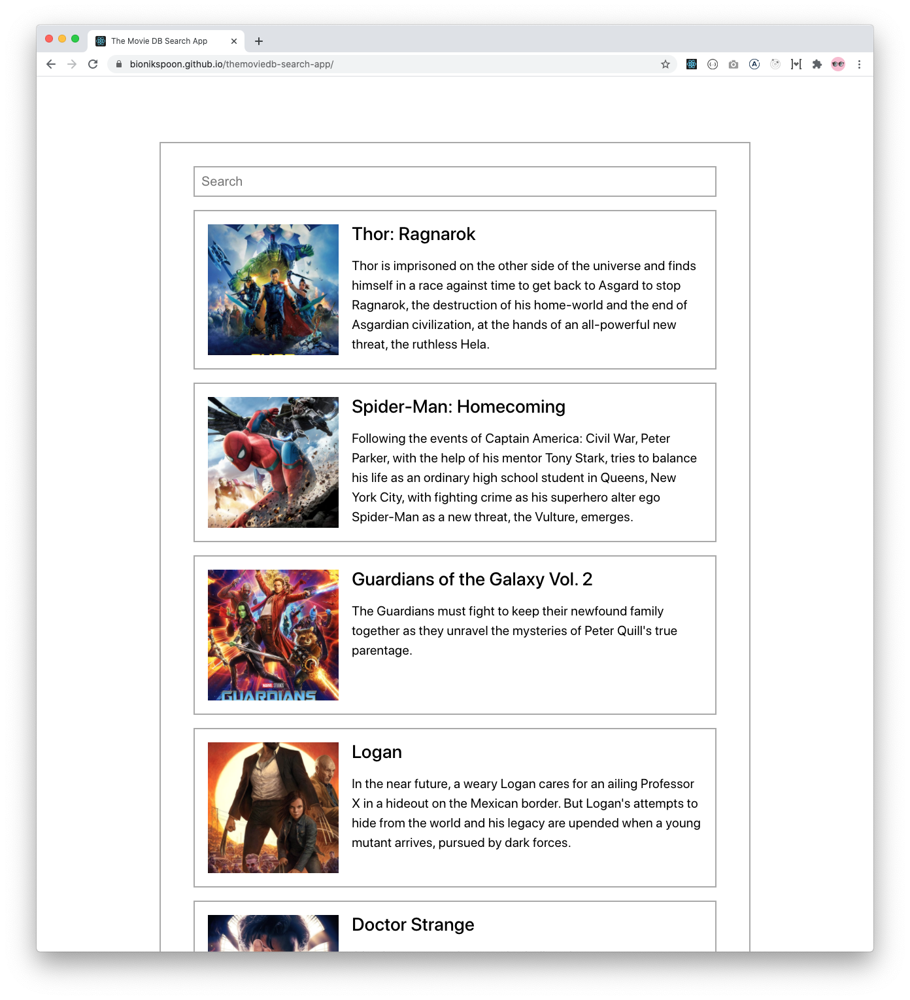
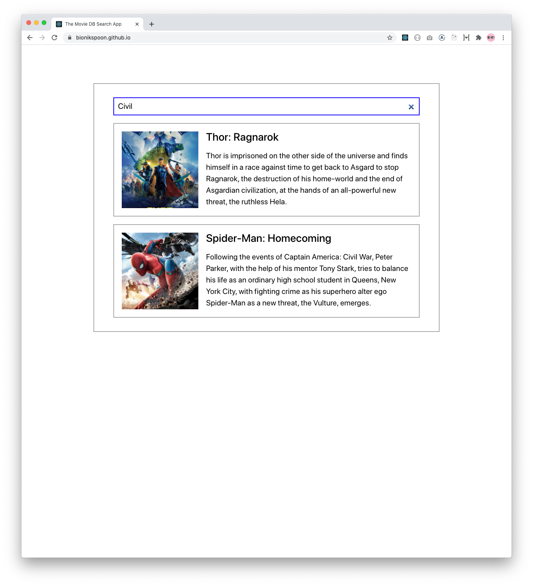
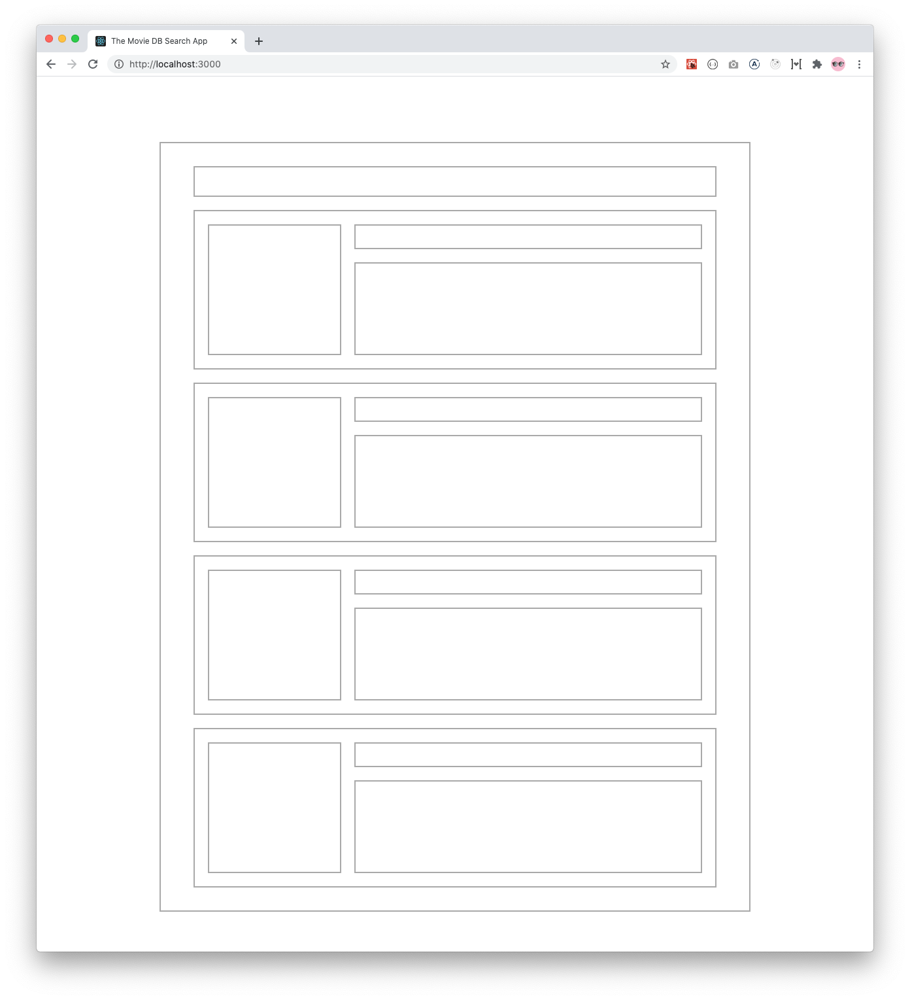

[](https://travis-ci.com/bionikspoon/themoviedb-search-app)

# The Movie DB Search App

A quick app to search The Movie DB.

## Screens





## Up and Running

This is a standard ([Create React
App](https://github.com/facebook/create-react-app)).

1. Prereq: Go grab an API key from [themoviedb.org/documentation/api](https://www.themoviedb.org/documentation/api)
1. Install dependencies

   ```sh
   yarn install
   ```

1. Setup your env variables

   ```sh
   cp .env.sample .env
   # Add your API key as `REACT_APP_THE_MOVIE_DB_BEARER_TOKEN`
   ```

1. Start your dev server

   ```sh
   yarn start
   ```

1. Run the tests

   ```sh
   yarn test
   ```
